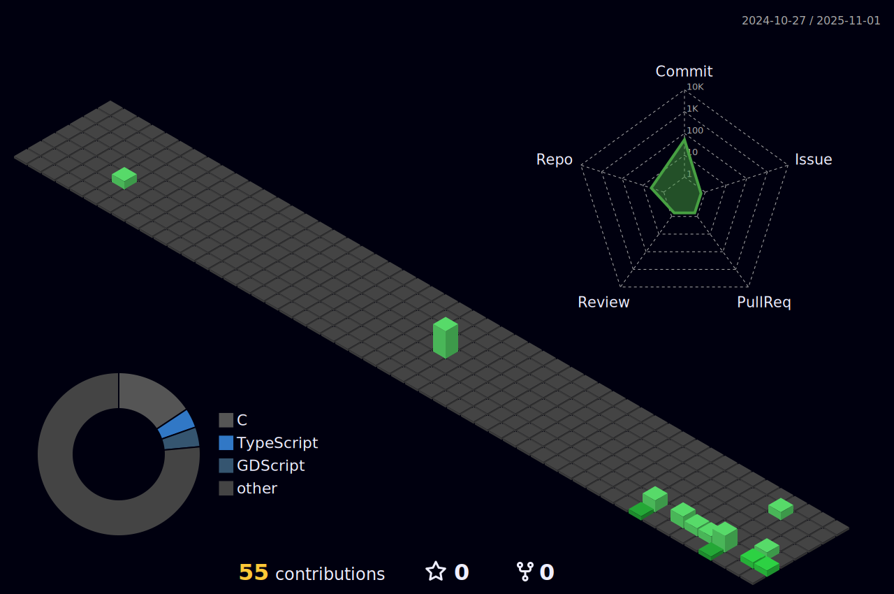

### Olá! Eu sou o Mateus de Rezende Santos 🖐

Estudante do segundo ano do Ensino Médio no SESI e atualmente estou cursando Desenvolvimento de Sistemas no Senai São Paulo. Como entusiasta de tecnologia, possuo habilidades em programação lógica, lógica programável e Microsoft Excel. Sou fluente em Português e possuo proficiência em Inglês.

  

 |  |  |  
 | ----------- | ----------- |

## 📜 Portfólio:

## 📞 Contato:

## 🕶 Habilidades:

  
  
  

